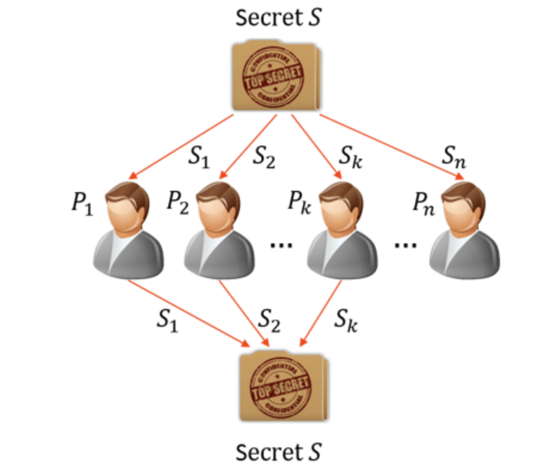
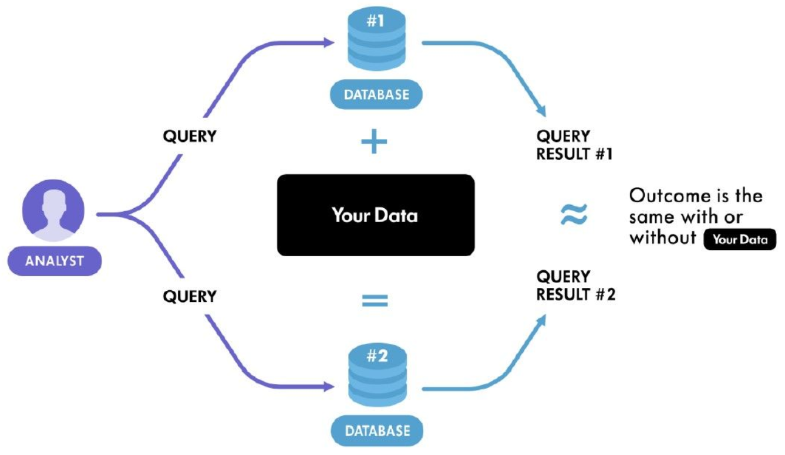
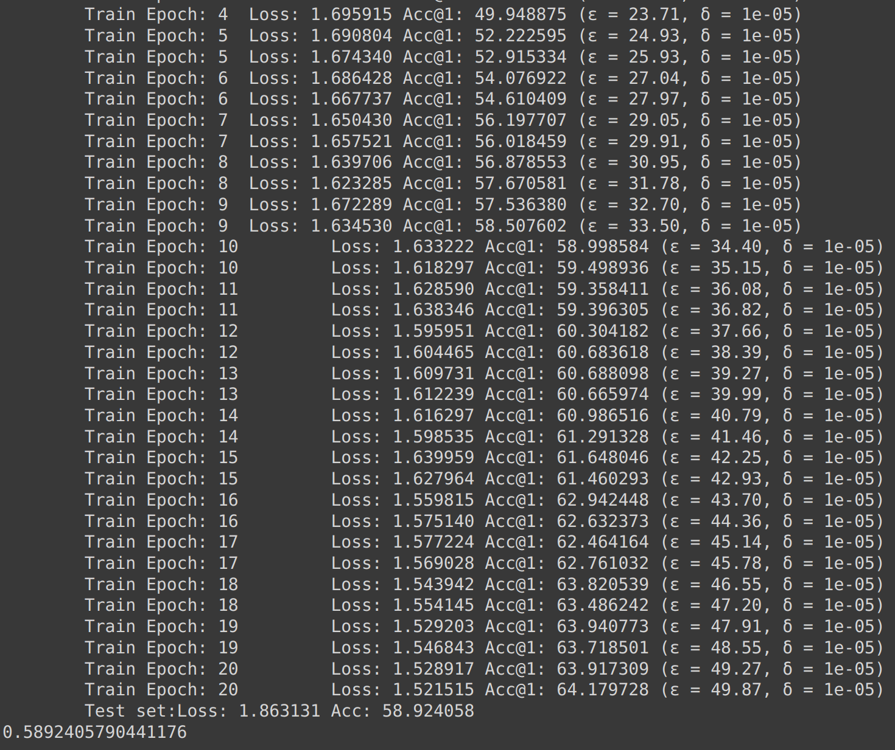

# CryptoGraphic functions for private data sharing

### shamir secret sharing : 

Shamir's Secret Sharing is a cryptographic method that divides a secret into multiple parts, called shares. A minimum number of shares is required to reconstruct the original secret. 
The system is based on polynomial interpolation and offers a secure way to distribute and safeguard sensitive information. There is an implementation of the same present here. 
We shall/can use Shamir Secret sharing for consensus among several clients regarding correct updated Params sharing. 


<hr>


### homomorphic encryption scheme : 

This is a cryptographic scheme that allows transfer of params in encrypted form. 
Allows arithematic operations on them in encrypted form and allows Decryption then to get the updated Params. 
There is an implementation of the same present here for Polynomial rings.
The main goal of an HE scheme is to compute on encrypted data but the catch with this scheme is that the amount of computation we can perform will depend on the chosen parameters, and there are no perfect parameters that work for all cases, we must choose them according to our scheme, the security we want to achieve and the computation you want to perform.


<hr>

### Differential Privacy : 

It states that the presence or absence of any individual record in the dataset should not significantly affect the outcome of the mechanism. 


<hr>

Suppose Bob is asked about a question with a binary answer of yes or no. Now We wont directly give the answer to the server. We would first do a coin toss. If its head, then we send the actual answer, if its tail, then we again do a coin toss. If its heads, we send a yes and if its tails, then we send a no. This is the most layman example of DP, so that the addition of another individual record leads to no significant change in the outcome of the model and also we can't say for sure whether bob's data is correct or not. A drawback of this is that we can't apply DP on small datasets.

Mathematically, this means this : 

A randomized mechanism M is (ϵ,δ)-differential private if any output set S and
any neighboring databases D and D′ satisfy the followings

Pr{M(d) ∈ S} ≤ exp(ϵ)Pr{ M(d′) ∈ S} + δ

where d is the original dataset and d' is the new dataset. Smaller the value of Ɛ, stronger the privacy guarantees, with ϵ = 0 representing perfect privacy. A nice property of DP mechanism, which we state here without proof, is that any post-processing applied to a DP mechanism is automatically DP. 

The core idea is to add noise onto training data, which would be added to model parameters and learnt indirectly, since the data used for training is modified. However here, we add noise onto model parameters instead of the data. 

There are two choices for noises. We can add Laplacian noise or gaussian noise. However, the use of Laplacian noise is preferred since the models are much less distorted compared to gaussian noise. 

To protect sensitive data in training a Generative Adversarial Network (GAN), the standard approach is to use differentially private (DP) stochastic gradient descent method in which controlled noise is added to the gradients.In Stochastic gradient method, when we update the weights after gradient by backpropagation, we only do it for one sample instead of all the samples present. However, this method called DPSGD is difficult to train because this complicated GAN does not necessarily converge to a noisy equilbrium, resulting in mode collapse
and/or poor synthetic sample quality. In the paper on DPGANs, they used WGANs. But we wont delve into it. 

we can implement DPSGD method by simply adding noise to the optimiser in pytorch since it is made to look at the parameter gradients. So it all boils down to how much noise should we be adding. Now we just need to add enough noise to hide the largest possible gradient. However, it is possible that the gradients are unbounded. To bound them, we can just clip the gradients by scaling it down to C. we call this C as the clipping threshold. 

here is a rather rough implementation of the same : 

```
from torch.nn.utils import clip_grad_norm_

optimizer = torch.optim.SGD(lr=args.lr)

for batch in Dataloader(train_dataset, batch_size=32):
    for param in model.parameters():
        param.accumulated_grads = []
    
    # Run the microbatches
    for sample in batch:
        x, y = sample
        y_hat = model(x)
        loss = criterion(y_hat, y)
        loss.backward()
    
        # Clip each parameter's per-sample gradient
        for param in model.parameters():
            per_sample_grad = p.grad.detach().clone()
            clip_grad_norm_(per_sample_grad, max_norm=args.max_grad_norm)  # in-place
            param.accumulated_grads.append(per_sample_grad)  
        
    # Aggregate back
    for param in model.parameters():
        param.grad = torch.stack(param.accumulated_grads, dim=0)

    # Now we are ready to update and add noise!
    for param in model.parameters():
        param = param - args.lr * param.grad
        param += torch.normal(mean=0, std=args.noise_multiplier * args.max_grad_norm)
        
        param.grad = 0  # Reset for next iteration
```

One way to go about it is by using the micro batching approach in which we check the gradient of each and every sample in our batch. A much faster approach would be to implement vectorized computation. We can do this making only the highway gradients (gradients with respect to activation) worry about per-sample. The exit gradients (gradients with respect to weights) need not worry about them. We can store the acitvations using the tensor hooks. We shall use two hooks to achieve this. Forward hook and the backward hook. In the forward hook, we store the activations and in the backward_hook, we use the highway grads and the input grads to compute the per sample grads. as we need to find the per sample grads, we can use ```einsum``` which allows us to do that in vectorized form. 

here is the output of a rather crude implemention of differential privacy in an image classifier : 


<hr>

Now lets worry about how to make a GAN differentially private. 

If we were to look at the forward pass of a convolutional layer, we can unfold it into a simple matrix multiplication and now we can simply use einsum for the same. The implementation for the same is in DPGANs folder. 