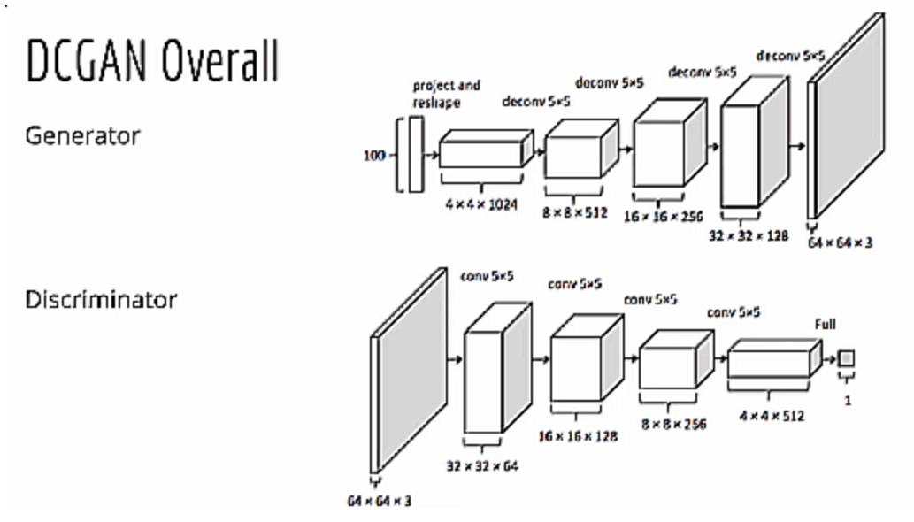
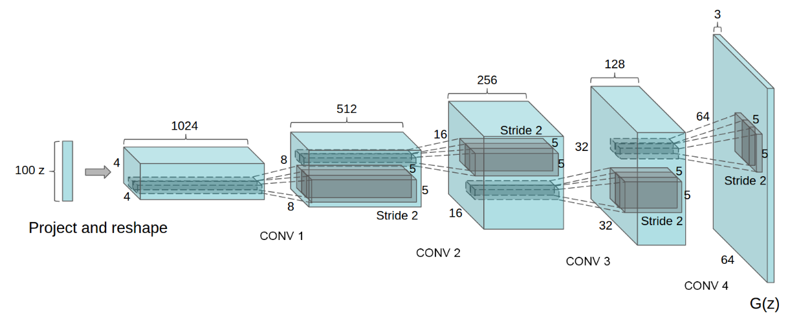
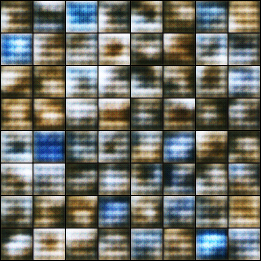
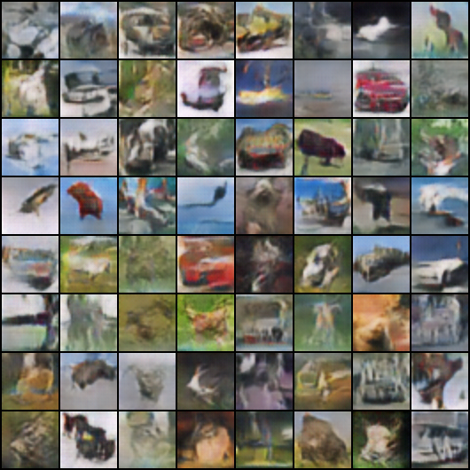
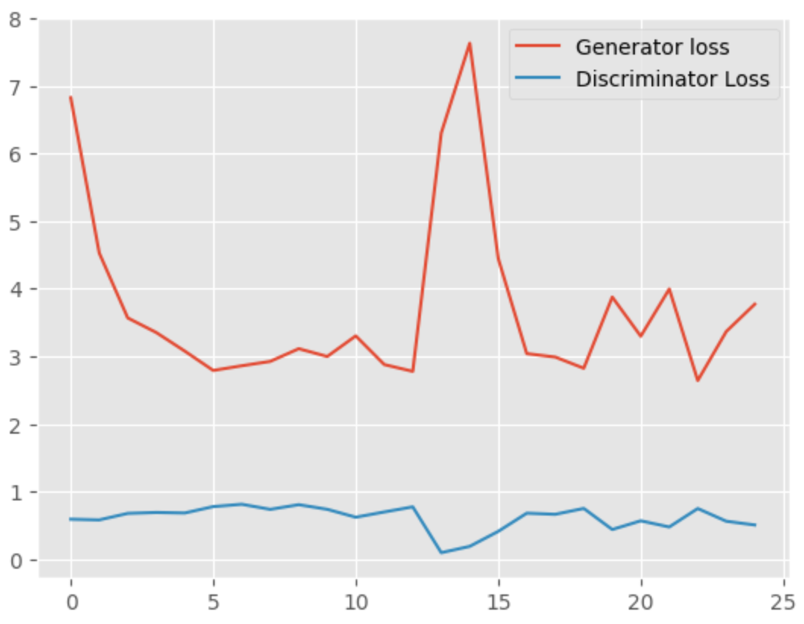

# DCGANs : Overview and Implementation

DCGANs (Deep Convolutional Generative Adversial Networks) : 

### Architecture

Architecture guidelines for stable Deep Convolutional GANs : 

• Replace any pooling layers with strided convolutions (discriminator) and fractional-strided convolutions (generator).

• Use batchnorm in both the generator and the discriminator.

• Remove fully connected hidden layers for deeper architectures.

• Use ReLU activation in generator for all layers except for the output, which uses Tanh.

• Use LeakyReLU activation in the discriminator for all layers

I find it a little stange that there are no fully connected layers in the complete architecture of DCGANs. We only have convolutional layers in the network. 

The generator network in the DCGAN model is structured like this : 

First, we give the generator a 100-dimensional noise vector as input, project and reshape it. Then we have 4 convolutional operations. Now each time we get an increment in height and width and the channels keep on reducing. We start with 512 output channels and reduce it down to 128. And finally we generate an image of 64 X 64 dimensions and three output channels. Also in the convolutional layers, after the first layer, all other layers have a stride of 2. 

Also in the architecture, we do not use max pooling for downsampling as should be clear from the fact that there are no fully connected layers. All the operations will be through strided convolutions only. 

The authors of the paper provide a stable way to train DCGAN and most of it boils down to two things. The first is how we build the generator/discriminator and the second is how we set the parameters/hyperparameters. 

In the generator, we use the ReLU activation function in all the layers except the last one. For the last layer, we use the Tanh activation Function. While For the discriminator, we will use LeakyReLU for all the convolutional layers after applying Batch Normalization. 

Further the authors have provided certain HyperParameters that I will use while implementing the DCGAN.

The Phenomenal Performance of DCGANs can be easily seen from the images generated after Epoch 1 and Epoch 25. 

Epoch 1 : 

Epoch 25 : 

### Analyzing the Outputs

From the above losses after each epoch, we can see that the loss for the generator initially was somewhat high as compared to discriminator. This is expected as in the beginning the generator cannot produce very good fake images. Therefore, the discriminator can easily classify them. As training progresses, the generator loss starts to reduce to anything between 3 and 4. Around this time, the discriminator loss increases as it is not longer able to classify the fake images with high probability. There is a spike in loss at around 14th Epoch but that is not much relevant as the loss then again stabilizes to between 3 and 4. 