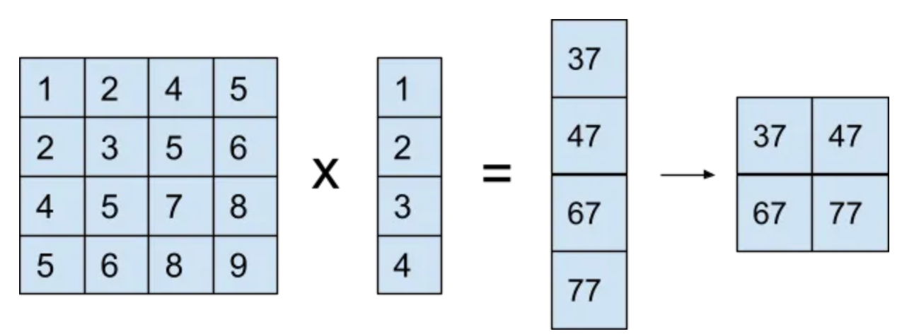
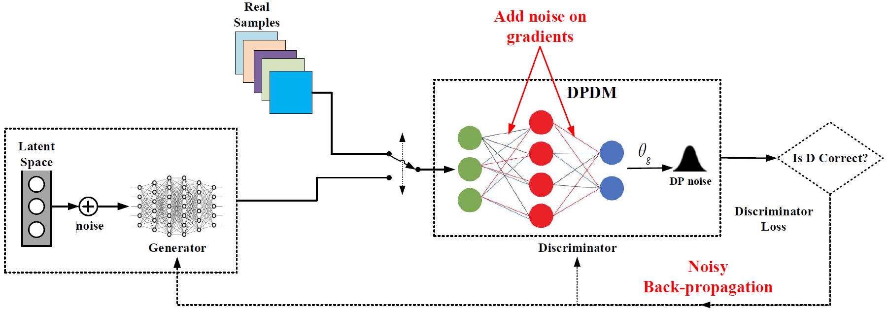
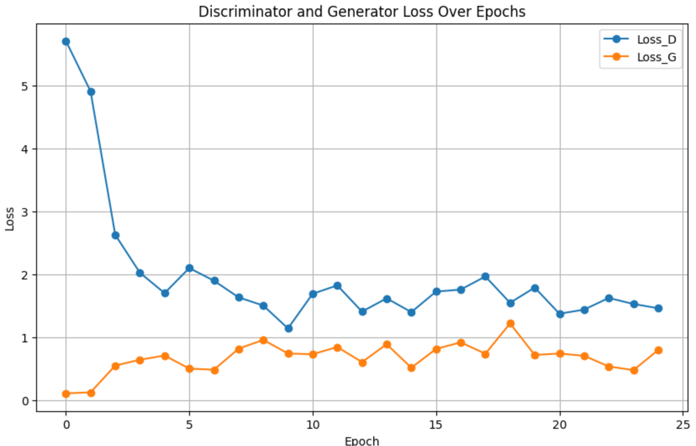
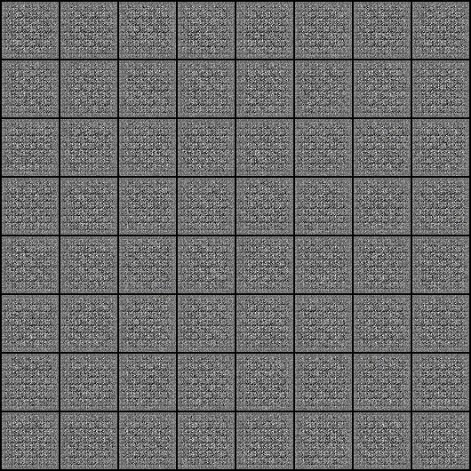

# Differentially Private GAN

The GAN architecture has been discussed in "GANs" Folder, the Deep Convolutional GANs architecture has been explained in DCGANs Folder and Differential Privacy has been explained in the "CryptoGraphy" folder. DPGAN is really just an amalgamation of all the knowledge from the above. 

At its very core, the architecure of DPGANs relies on adding noise to the weights of the convolutional layers. The process is made efficient by utilising the ```einsum``` from pytorch. Further we are only able to use ```einsum``` because we are able to convert a matrix multiplication that is used during the normalization process in GAN training to a rather simplified vector multiplication. 


<hr>

Here is very high level overview of the architecture of DPGAN : 


<hr>

So we need to add noise to the gradients of the discriminator. Since in pytorch, the optimiser deals with the updation of gradients, it makes sense to add noise when we use the optimiser. And that is exactly what we do in the training process. We update the optimiser so as to add some laplacian noise during backpropagation step of every data from all batches.

# Results

After training the model for 25 epochs, The losses show a considerable decline for the Discriminator and it remains rather constant for Generator. I am sure the model will give better results if trained for further Epochs. 


<hr>

Here is a visual representation of the remarkable results produced by the DPGAN. 


<hr>