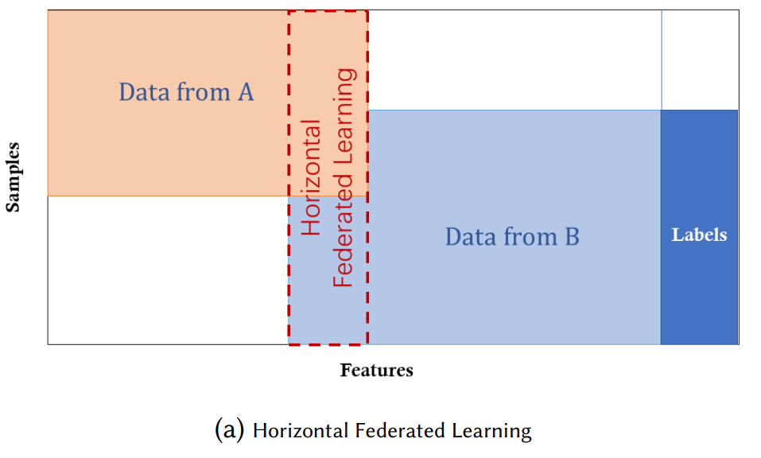

# Federated Learning

The FL architecture in its basic form consists of a curator or server that sits at its center and coordinates the training activities. The main idea is to build machine learning models based on data sets that are distributed across multiple devices while preventing data leakage. 

However, In real-world scenarios, where data originate from different organizational entities, covariate shift is common technical challenges. 

There are 3 types of Federated Learning, namely Horizontal, Vertical and Federated Transfer. 

For the implementation of GANs, Horizontal Federated Learning is an optimal choice because it is quite feasible to assume that different clients will share the same feature space but are different in samples. 


<hr>

# Architecture of HFE

In this system, k participants with the same data structure collaboratively learn a machine learning model with the help of a parameter or cloud server. A typical assumption is that the participants are honest whereas the server is honest-but-curious, therefore no leakage of information from any participants to the server is allowed. The training process of such a system usually contains the following four steps:
• Step 1: participants locally compute training gradients, mask a selection of gradients with, differential privacy and send masked results to the server; 
• Step 2: Server performs secure aggregation without learning information about any participant;
• Step 3: Server send back the aggregated results to participants;
• Step 4: Participants update their respective model with the aggregated gradients.


<hr>

# Communication

A daunting task in generating a federated framework was the communication process. With multiple clients sending requests rather Asynchronously, It becomes a problem to send the aggregated params to them synchronously. But this is where JS callback came to the rescue. I batched all the requests into one and sent the response only after getting requests from a specific number of clients. As for the client side, I used the ```request``` module from Python for sending requests. 

# Aggregation

This posed a dilemma to me. As the parameters for a model will depend on how u define its inner layers, so there is no way to make a common federated framework. Nevertheless, writing the aggregation logic is not a big deal, once u have the params. The Logic I have used is : 

1. **Secure Weighted Averaging:**
   I implemented a secure weighted averaging mechanism to combine model updates from participating devices. Let  represent the weight assigned to the update from device \(i\), and  denote the model update from device \(i\). The aggregated update  is computed as follows:

   

2. **Differential Privacy Preservation:**
   The aggregation logic incorporates differential privacy techniques to protect the privacy of individual device data. The aggregated update is modified to ensure \(\epsilon\)-differential privacy, where \(\epsilon\) is the privacy parameter.

3. **Adaptive Learning Rate Adjustment:**
   dynamically adjusts learning rates during the aggregation process based on the historical performance of individual devices. The learning rate  for device \(i\) is updated based on a performance metric, and the aggregated update is obtained as:

   

4. **Gradient Clipping and Norm Regularization:**
   To mitigate potential issues related to extreme gradients, apply gradient clipping and norm regularization during the aggregation. Let  represent the gradient from device \(i\), and the aggregated gradient  is computed as:

   )

5. **Asynchronous Update Handling:**
   To accommodate devices with varying computation capabilities and network latencies, my aggregation logic includes an asynchronous update handling mechanism. Updates are accumulated asynchronously, and the aggregated update is computed at predefined intervals.

Right now, 1st, 2nd and 5th has been implemented. 

# Results 

I have seen significant improvement in the accuracy of the model by just increasing one client to five clients. For now, I have tested the framework on a rather simple neural network only. 

Here is the result of the five clients, each with enhanced accuracy : 

```
Epoch 100/100, Loss: 0.01075044460594654
Prediction for input 5: 9.82392406463623

Epoch 100/100, Loss: 0.0038719559088349342
Prediction for input 5: 10.131973266601562

Epoch 100/100, Loss: 0.010961776599287987
Prediction for input 5: 9.725300788879395

Epoch 100/100, Loss: 0.018724355846643448
Prediction for input 5: 9.765052795410156

Epoch 100/100, Loss: 0.006704922765493393
Prediction for input 5: 9.883999824523926
```