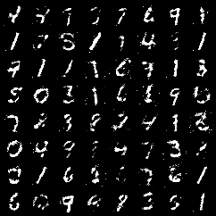

# GANs : Overview and Implementation

GANs (Generative Adversial Networks) : 
 
Generative Adversarial Networks (GANs) are classified within the realm of generative models. These models operate as unsupervised learning techniques, wherein the training process does not involve the provision of explicit labels or targets to the neural network model. The intrinsic nature of GANs as generative models manifests in their capacity to generate novel instances of data that exhibit similarities to the training dataset.
 
Generative Adversarial Networks (GANs) are structured with dual neural network components, namely the generator and the discriminator.

During the training phase of a GAN, the generator endeavors to synthesize spurious data from an initially noisy sample space. Through iterative processes, it refines its ability to produce increasingly authentic data.

Simultaneously, the discriminator is tasked with distinguishing authentic data from the artificially generated data produced by the generator. In the course of discriminator training, both genuine data (positive examples) and generated data (negative examples) are presented. The training regimen continues until a point is reached where the discriminator becomes incapable of reliably discerning between real and fake data, specifically the data generated by the generator. It is at this juncture that the training is halted, indicating the successful development of the generator's capability to produce realistic data mirroring the characteristics of the input dataset

### The Training

The Training of the GANs follows this step-by-step procedure : 

**Discriminator**
1. we give the real data and fake generator data as input to the discriminator.
2. The discriminator classifies between fake data and real data. From this classification, we get the discriminator loss. 
3. If the discriminator misclassifies the data, then it is penalized. Misclassification can happen in two ways. Either when the discriminator classifies the real data as fake or when it classifies the fake data as real.
4. the weights get updated through backpropagation. The backpropagation in discriminator happens through the discriminator network. 

***The updated gradients from the discriminator training are not passed down to the generator***

**Generator**
1. we have the random input or the latent vector or the noise vector.
2. This random input is given to the generator and it generates the fake data.
3. Then the discriminator network comes into play. At this step, the discriminator tries to classify the generated data as fake.
4. We have the generator loss from the generator outputs. This generator loss penalizes the generator itself if it is not able to fool the discriminator.

The ***important*** thing to note here is that we back propagate through the Discriminator twice while we backpropagate only once through the generator. This is because when we are training the generator, we backpropagate and loop through the Discriminator. This is necessary because the Discriminator still needs feedback about the performance of the generator. However, the Discriminator parameters do not get updated during this process. Also from these steps, we can say that the generator and the discriminator train alternately. 

### Loss Function

In the original paper on GANs, the ***minimax loss*** function is described which is actually a form of the very common binary-cross entropy loss. D(G(z)) is the probability by the discriminator that the data generated by the generator (G(z)) is real. Thus we want to maximize this term while training the generator. But again, to minimize the whole loss function, we need to minimize the log(1−D(G(z))) term. While D(x) is the prob that given the real data, the discriminator is able to classify it as real. Thus ideally we would like it to be 1. 

You can find the orignial paper attatched in this folder by the name "paper.pdf"

### Results

Here is the generated image after the 146th Epoch : 

