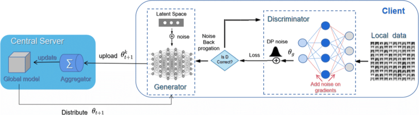
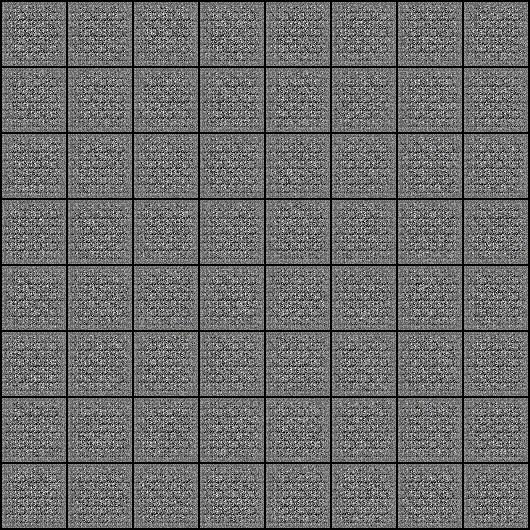

# FLivGen: Private Synthetic data generation on the FLY

There is a dearth of data like medical data, military data etc. which is needed to make better models. But at the same time, this data is private and nobody wants to share this data with a third party. The answer to this dilemma is Federated Learning. A distributed Learning mechanism that has made it possible to train models on remote datasets. Add Differential Privacy on top of it and the system becomes solid as a rock, no more adversarial attacks. 

This project is aimed at creating such a framework for Generative Adversarial Networks.

I have read and implemented the research papers on GANs and DCGANs. Further to make it secure, I have studied various cryptographic techniques like Shamir secret sharing, Homomorphic encryption and differential privacy. Out of which I decided to go with Differential privacy. You can find code for all three of them here. 

As for the Federated learning scheme, I went through various frameworks for it. But none of them were flexible to my needs. So I decided to create one of my own. I used callbacks to synchronize delays in clients' communication and gradient sharing from PyTorch to send the parameters for aggregation. I had earlier decided to use hooks from PyTorch but later shifted to a much simpler approach. 

# Architecture

Here is an overview of the architecture of the project : 


<hr>

1. Firstly to make the DCGAN, I made a model with different convolutional layers and activation functions with hyper parameters that I took from the paper. Here is a high level overview of the same : 

```
class Discriminator(nn.Module):
    def __init__(self):
        super(Discriminator, self).__init__()
        self.main = nn.Sequential(  # We use the sequential container to build the discriminator network
            nn.Conv2d(
                3, 64, kernel_size=4,
                stride=2, padding=1, bias=False),
            # 3 input channels for the colored images
            # We will take the hyper-parameters as it is specified in the paper. So We specify the slope of the LeakyReLU as 0.2
            nn.LeakyReLU(0.2, inplace=True),
            nn.Conv2d(
                64, 128, kernel_size=4,
                stride=2, padding=1, bias=False),
            nn.BatchNorm2d(128),
            nn.LeakyReLU(0.2, inplace=True),
            nn.Conv2d(
                128, 256, kernel_size=4,
                stride=2, padding=1, bias=False),
            nn.BatchNorm2d(256),
            nn.LeakyReLU(0.2, inplace=True),
            nn.Conv2d(
                256, 512, kernel_size=4,
                stride=2, padding=1, bias=False),
            nn.BatchNorm2d(512),
            nn.LeakyReLU(0.2, inplace=True),
            nn.Conv2d(
                512, 1, kernel_size=4,
                stride=1, padding=0, bias=False),
            # The output of the last convolution layer is a single number. This number is the probability of the
            # input image being real or fake. We use a Sigmoid activation function to get the probability.
            nn.Sigmoid()
        )

    def forward(self, input):
        # The forward() function forward passes either the real image or fake image batch through the
        # discriminator network. Then the discriminator returns the binary classifications for the batch.
        return self.main(input)
```

2. Now onto differential privacy, I used ```opacus``` to induce noise in the gradients of my discriminator with the help of the privacy engine given by opacus. It uses hooks and ```einsum``` from pytorch under the hood. 

3. Now for the Federated Learning framework, I wrote a JS server, made it communicate with my py model and synchronized it with callbacks. 

# Results

Here is a GIF representation of the images produced by my Differentially Private Deep convolutional generative adversarial network for 25 epochs : 


<hr>

The results from my federated Learning Framework for a rather simple neural network. Here is the result of the five clients, each with enhanced accuracy:

```
Epoch 100/100, Loss: 0.01075044460594654
Prediction for input 5: 9.82392406463623

Epoch 100/100, Loss: 0.0038719559088349342
Prediction for input 5: 10.131973266601562

Epoch 100/100, Loss: 0.010961776599287987
Prediction for input 5: 9.725300788879395

Epoch 100/100, Loss: 0.018724355846643448
Prediction for input 5: 9.765052795410156

Epoch 100/100, Loss: 0.006704922765493393
Prediction for input 5: 9.883999824523926
```

<hr>

made with ❤️ by [shogo](https://twitter.com/ShogLoFi)
